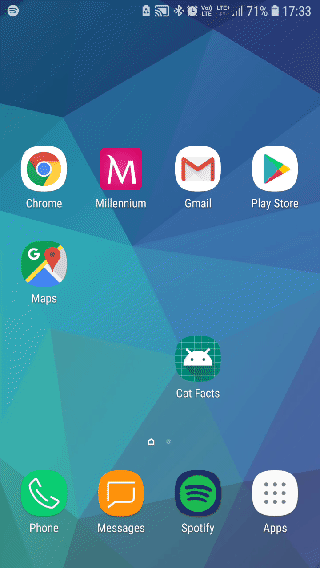

# MicroConf #4 - Cat Facts Sample Application

MicroConf #4: Eating Apple or flying Jetpack? Mobile microConf

This is sample application of Android MVVM structure for conference's talk and workshop.
Application uses [public API](https://alexwohlbruck.github.io/cat-facts).

## Technologies

Sample application is implemented using:

* DataBinding
* ViewModel + LiveData
* Room
* Dagger 2.12+
* Retrofit
* RxJava 2
* Robolectric
* Mockito

## API

Great thanks to [Alex Wohlbruck](https://github.com/alexwohlbruck) 
for presenting [API](https://github.com/alexwohlbruck/cat-facts).